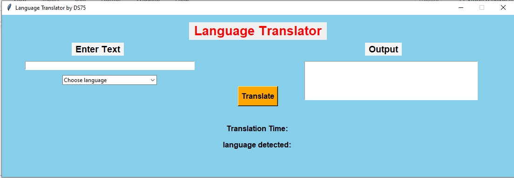
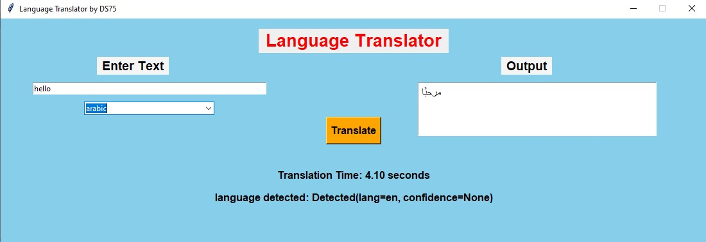

# Language Translator Application
This project is a simple language translator application that translates text between various languages. 
It uses the Googletrans library for translations and Tkinter for creating the user interface (UI). 
The application allows users to input text in one language and get the translated output in another selected language.

## Features
- Translate text between multiple languages.
- Easy-to-use graphical interface with text boxes for input and output.
- Dropdown menus to select source and target languages.
- Fast and accurate translation using Google's translation API.

## Screenshot

## How It Works
The application uses the Googletrans library (a free and unofficial Google Translate API) to handle translations. 
The user inputs text into a text box, selects the source and target languages from dropdown menus, and clicks the "Translate" button. 
The translated text is displayed in another text box. It also shoes the timing required for the translation 

### Technologies Used:
- Googletrans: For language translation.
- Tkinter: For the graphical user interface (GUI).
## Usage
- Open the application.
- Enter the text you want to translate.
- Select the source language and the target language from the dropdown menus.
- Click the "Translate" button to get the translation in the output box.

## screenshot

## Project Structure
Language translator.py: Main script that contains the Tkinter GUI and translation logic.
requirements.txt: List of required Python packages.

## Future Scope
Add speech-to-text functionality for spoken input.
Improve UI with better styling and error handling.
Add more advanced features, such as automatic language detection.
